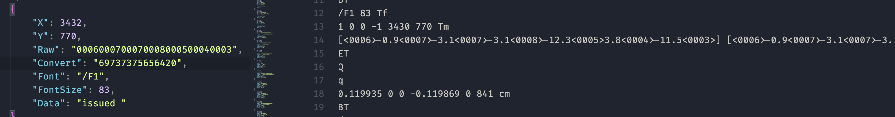
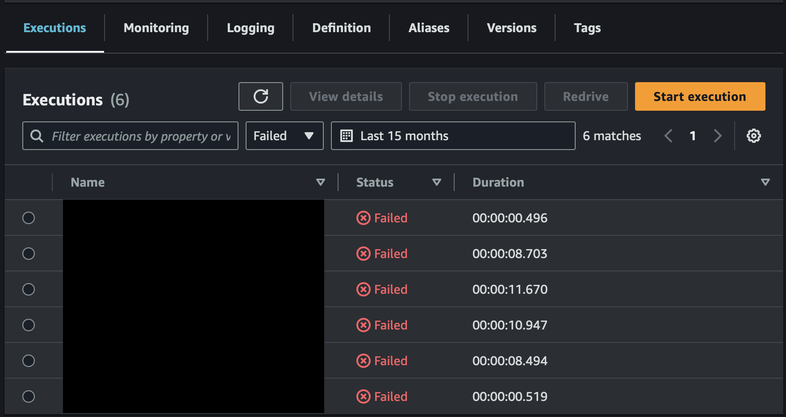
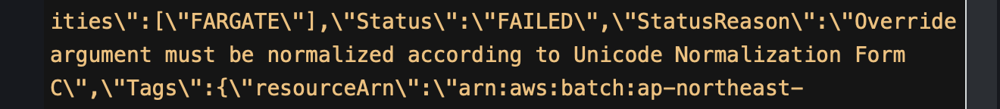
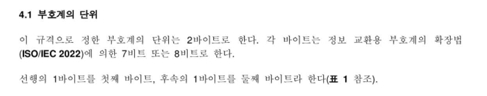

import {
  Table,
  TableCaption,
  TableContainer,
  Thead,
  Tbody,
  Tr,
  Th,
  Td,
} from "@chakra-ui/react";

### 인코딩 지옥의 시작

#### PDF 텍스트 추출기를 제작해보면서...

 

 

이미지는 텍스트 추출 시 오른쪽의 Raw CID를 매핑해서 issued 라는 데이터로 변경시킨 것이다.
이처럼 PDF에서 텍스트를 추출하려면 내부의 CID를 CMap을 통해 매핑해야한다. 다음은 Adobe 한국어 CMap 이다.

 

- [한국어 CMap](https://github.com/adobe-type-tools/cmap-resources/tree/master/Adobe-Korea1-2/CMap) : `{문자 집합}-{인코딩}-{세로/가로}`의 형식 

이걸 찾아서 하나씩 매핑하고 있는데, 

 
 

#### 잘 돌아가던 SFN의 실패...

 

잘 돌아가던 [sfn(AWS Step Functions)](https://docs.aws.amazon.com/ko_kr/step-functions/latest/dg/welcome.html)에서 실패가 발생하기 시작했다.
순간 흠칫했지만, 상태머신은 친절하게 이유를 알려줘서 다행이었다.

 

 

batch로 보내는 argument는 정규화 되어야 한다고 한다.
내가 argument로 사용하는 파일명이 한글이고 정규화가 되지 않아서 생긴 문제였다.
이 문제는 NFC(Unicode Normalization Form C)로 정규화 하는 코드를 추가해서 해결하기는 했다.

가끔가다 이런 식으로 인코딩 관련해서 문제가 발생하거나 스트레스를 받으면, 언젠가 한 번은 정리를 해놓아야 하지 않을까 하다가 지금에서야 이 포스트를 작성한다.

### Codepage와 Unified Hangul Code (cp949)

컴퓨터에서 문자를 표현하기 위해서 어떤 방식을 사용하는지 생각해보자. 보통 영어만 사용하거나 처음 C언어를 배울 때는, [ASCII Code](https://ko.wikipedia.org/wiki/ASCII)를 배우게 된다.
ascii code는 코드값과 문자를 1:1로 대응 시킨다. 사용하는 코드값은 7비트로 총 128($2^7$)개의 문자를 표현할 수 있다.
즉, 컴퓨터에서 문자를 표현하는 방법은 단순하게 "A코드를 'a'로 표현해라"라는 것이고, 표현된 언어를 다시 코드로 변경할 수도 있다.

여기서 문자를 코드로 변경하는 과정이 **encoding**이고, 코드를 문자로 변경하는 과정이 **decoding** 이다.

#### Codepage

Encode와 Decode를 할 때 사용하는 매핑 정보를 IBM에서 [**Code page**](https://en.wikipedia.org/wiki/Code_page)라고 부르기 시작했다고 한다. (말이 어려운데 문자\<-\>코드 변환 표라고 생각하면 편하다.)

IBM은 이 Code page를 문자의 특성에 따라 숫자로 분류했는데, 예시로는 다음과 같은 것들이 있다. 예시에 포함된 Code page의 사용처가 IBM PC DOS 운영체제인 것을 주의하자.

<TableContainer whiteSpace={"normal"} id={"cp-table-ref"}> 
  <Table variant="simple">
    <TableCaption>IBM PC DOS 운영체제의 codepage 목록</TableCaption>
    <Thead>
      <Tr>
        <Th>number</Th>
        <Th>identifier</Th>
        <Th>description</Th>
      </Tr>
    </Thead>
    <Tbody>
      <Tr>
        <Td>[437](https://web.archive.org/web/20080101144615/http://www.microsoft.com/globaldev/reference/oem/437.mspx)</Td>
        <Td>Original IBM PC hardware code page</Td>
        <Td>ascii 의 7비트에서 1비트를 추가해 8비트로 ascii 코드를 확장한 테이블(codepage)를 만들었다.</Td>
      </Tr>
      <Tr>
        <Td>[949](https://en.wikipedia.org/wiki/Code_page_949_(IBM))</Td>
        <Td>Korean (Extended Wansung (ks_c_5601-1987))</Td>
        <Td>흔히 ibm-949나 cp949로 부르는 녀석이다. euc-kr 과 호환된다. (euc-kr과 호환되지만 [windows-949](https://en.wikipedia.org/wiki/Unified_Hangul_Code) 와는 엄연히 다르다.)</Td>
      </Tr>
      <Tr>
        <Td colSpan={"3"} textAlign={"center"}>... 그 외의 이것저것</Td>
    </Tr>
    </Tbody>
  </Table>
</TableContainer>

>  더 다양한 code page는 위키피디아나 ibm, windows 에서 정리한 문서를 확인하자. [위키피디아](https://en.wikipedia.org/wiki/Code_page#IBM_code_pages)

#### 그렇다면 한글 인코딩은 어떻게 하는가?

한글 인코딩은 한국산업표준 [KS X 1001(KS C 5601)](https://standard.go.kr/KSCI/standardIntro/getStandardSearchView.do?ksNo=KSX1001)에서 시작한다.
정식 명칭은 **정보 교환용 부호계 (한글 및 한자)** 이다.

 

 

완성형으로 부르기도 하며, 현대 한글에서 사용 빈도가 높은 문자를 2바이트에 범위내에 매핑을 시키는 방식이다. 아무래도 글자를 추려서 매핑을 하기 때문에 모든 한글을 포함하지는 않는다.

##### EUC-KR

우선 EUC(Extended Unix Code)는 한글, 일어, 한자 등을 표현하기 위해 만들어진 가변 길이 인코딩 시스템이다.

거기서 **EUC-KR은 한글을 표현하기 위해 만들어진 EUC**인 것이고,
표현하는 한글을 위의 **KS X 1001** 과 **KS X 1003** 같은 표준에서 채택한거다.
결국 euc-kr이 2바이트라고 하는 것은 KS X 1001에서 한글이 2바이트 영역에 매핑되어 있기 때문이다.

Microsoft 에서는 Code page 51949로 구분한다.

> **KS X 1003** 은 ASCII를 의미한다. 역슬래시가 연화로 표시되는 등의 특징이 있다.

##### cp949(MS949)

EUC-KR에서는 표현하지 못하는 한글도 표현할 수 있도록 MS가 만든 Code page 를 의미한다. 
Unified Hangul Code (UHC) 라고도 한다. 

여기서 주의할 점은 cp949는 IBM의 것과 MS의 것이 따로 있다는 점이다. 혹여나 같은 cp949로 표기되어있는데, 인코딩이 이상하다면 다음을 의심하자.

- IBM의 Code page 949 : EUC-KR과 같다. 즉, 모든 한글을 표현할 수 없다.
- MS의 Code Page 949 : 모든 한글을 표기한다.

### Ref.

- [Microsoft Code page](https://learn.microsoft.com/en-us/windows/win32/intl/code-page-identifiers)