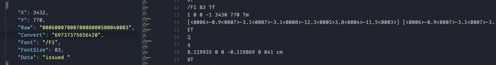
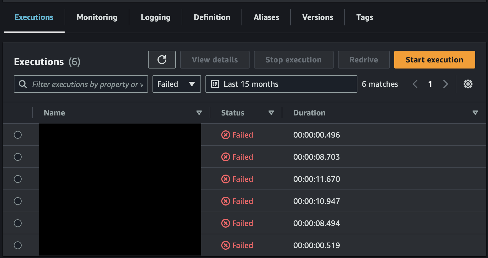
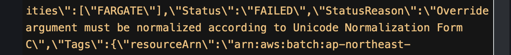
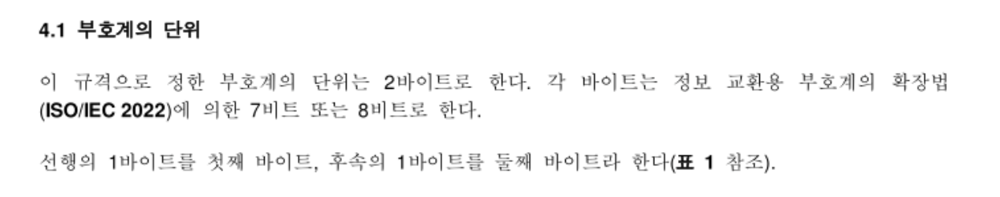

import {
  Table,
  TableCaption,
  TableContainer,
  Thead,
  Tbody,
  Tr,
  Th,
  Td,
} from "@chakra-ui/react";

### 인코딩 지옥의 시작

#### PDF 텍스트 추출기를 제작하면서...

<br/>



<br/>

이미지는 텍스트 추출 시 오른쪽의 Raw CID를 매핑해서 issued 라는 데이터로 변경시킨 것이다.
이처럼 PDF에서 텍스트를 추출하려면 내부의 CID를 CMap을 통해 매핑해야한다. 다음은 Adobe 한국어 CMap 이다.

<br/>

- [한국어 CMap](https://github.com/adobe-type-tools/cmap-resources/tree/master/Adobe-Korea1-2/CMap) : `{문자 집합}-{인코딩}-{세로/가로}`의 형식 

이걸 찾아서 하나씩 매핑하고 있는데, CMap을 잘못 고르면 글자가 깨진다.

<br/>

#### 잘 돌아가던 SFN의 실패...



<br/>

잘 돌아가던 [sfn(AWS Step Functions)](https://docs.aws.amazon.com/ko_kr/step-functions/latest/dg/welcome.html)에서 실패가 발생하기 시작했다.
순간 흠칫했지만, 상태머신은 친절하게 이유를 알려줘서 다행이었다.

<br/>



<br/>

batch로 보내는 argument는 정규화 되어야 한다고 한다.
내가 argument로 사용하는 파일명이 한글이고 정규화가 되지 않아서 생긴 문제였다.
이 문제는 NFC(Unicode Normalization Form C)로 정규화 하는 코드를 추가해서 해결하기는 했다.

가끔가다 이런 식으로 인코딩 관련해서 문제가 발생하거나 스트레스를 받으면, 언젠가 한 번은 정리를 해놓아야 하지 않을까 하다가 지금에서야 이 포스트를 작성한다.

### Codepage와 Unified Hangul Code (cp949)

컴퓨터에서 문자를 표현하기 위해서 어떤 방식을 사용하는지 생각해보자. 보통 영어만 사용하거나 처음 C언어를 배울 때는, [ASCII Code](https://ko.wikipedia.org/wiki/ASCII)를 배우게 된다.
ascii code는 코드값과 문자를 1:1로 대응 시킨다. 사용하는 코드값은 7비트로 총 128($2^7$)개의 문자를 표현할 수 있다.
즉, 컴퓨터에서 문자를 표현하는 방법은 단순하게 "A코드를 'a'로 표현해라"라는 것이고, 표현된 언어를 다시 코드로 변경할 수도 있다.

여기서 문자를 코드로 변경하는 과정이 **encoding**이고, 코드를 문자로 변경하는 과정이 **decoding** 이다.

#### Codepage

Encode와 Decode를 할 때 사용하는 매핑 정보를 IBM에서 [**Code page**](https://en.wikipedia.org/wiki/Code_page)라고 부르기 시작했다고 한다. (말이 어려운데 문자\<-\>코드 변환 표라고 생각하면 편하다.)

IBM은 이 Code page를 문자의 특성에 따라 숫자로 분류했는데, 예시로는 다음과 같은 것들이 있다. 예시에 포함된 Code page의 사용처가 IBM PC DOS 운영체제인 것을 주의하자.

<TableContainer whiteSpace={"normal"} id={"cp-table-ref"}> 
  <Table variant="simple">
    <TableCaption>IBM PC DOS 운영체제의 codepage 목록</TableCaption>
    <Thead>
      <Tr>
        <Th>number</Th>
        <Th>identifier</Th>
        <Th>description</Th>
      </Tr>
    </Thead>
    <Tbody>
      <Tr>
        <Td>[437](https://web.archive.org/web/20080101144615/http://www.microsoft.com/globaldev/reference/oem/437.mspx)</Td>
        <Td>Original IBM PC hardware code page</Td>
        <Td>ascii 의 7비트에서 1비트를 추가해 8비트로 ascii 코드를 확장한 테이블(codepage)를 만들었다.</Td>
      </Tr>
      <Tr>
        <Td>[949](https://en.wikipedia.org/wiki/Code_page_949_(IBM))</Td>
        <Td>Korean (Extended Wansung (ks_c_5601-1987))</Td>
        <Td>흔히 ibm-949나 cp949로 부르는 녀석이다. euc-kr 과 호환된다. (euc-kr과 호환되지만 [windows-949](https://en.wikipedia.org/wiki/Unified_Hangul_Code) 와는 엄연히 다르다.)</Td>
      </Tr>
      <Tr>
        <Td colSpan={"3"} textAlign={"center"}>... 그 외의 이것저것</Td>
    </Tr>
    </Tbody>
  </Table>
</TableContainer>

>  더 다양한 code page는 위키피디아나 ibm, windows 에서 정리한 문서를 확인하자. [위키피디아](https://en.wikipedia.org/wiki/Code_page#IBM_code_pages)

#### 그렇다면 한글 인코딩은 어떻게 하는가?

한글 인코딩은 한국산업표준 [KS X 1001(KS C 5601)](https://standard.go.kr/KSCI/standardIntro/getStandardSearchView.do?ksNo=KSX1001)에서 시작한다.
정식 명칭은 **정보 교환용 부호계 (한글 및 한자)** 이다.

<br />



<br />

완성형으로 부르기도 하며, 현대 한글에서 사용 빈도가 높은 문자를 2바이트에 범위내에 매핑을 시키는 방식이다. 아무래도 글자를 추려서 매핑을 하기 때문에 모든 한글을 포함하지는 않는다.

##### EUC-KR

우선 EUC(Extended Unix Code)는 한글, 일어, 한자 등을 표현하기 위해 만들어진 가변 길이 인코딩 시스템이다.

거기서 **EUC-KR은 한글을 표현하기 위해 만들어진 EUC**인 것이고,
표현하는 한글을 위의 **KS X 1001** 과 **KS X 1003** 같은 표준에서 채택한거다.
결국 euc-kr이 2바이트라고 하는 것은 KS X 1001에서 한글이 2바이트 영역에 매핑되어 있기 때문이다.

Microsoft 에서는 Code page 51949로 구분한다.

> **KS X 1003** 은 ASCII를 의미한다. 역슬래시가 연화로 표시되는 등의 특징이 있다.

##### cp949(MS949)

EUC-KR에서는 표현하지 못하는 한글도 표현할 수 있도록 MS가 만든 Code page 를 의미한다. 
Unified Hangul Code (UHC) 라고도 한다. 

여기서 주의할 점은 cp949는 IBM의 것과 MS의 것이 따로 있다는 점이다. 혹여나 같은 cp949로 표기되어있는데, 인코딩이 이상하다면 다음을 의심하자.

- IBM의 Code page 949 : EUC-KR과 같다. 즉, 모든 한글을 표현할 수 없다.
- MS의 Code Page 949 : 모든 한글을 표기한다.

### Unicode

cp949까지의 인코딩은 공통적으로 **"이 바이트 값은 이 문자다"** 라는 표를 언어마다 따로 갖는 방식이다.
한글은 cp949, 일본어는 Shift_JIS, 중국어는 GBK… 파일을 열 때마다 어떤 code page로 해석할지 맞춰야 했고, SFN에서 겪었던 것처럼 같은 문자라도 **정규화 형태**가 다르면 다른 바이트열이 되기도 한다.

이 문제를 한 번에 풀려고 등장한 것이 [Unicode](https://unicode.org/)다.

#### Code Point와 UTF

Unicode는 전 세계 문자에 **고유한 번호(code point)** 를 부여한다. `U+0041`은 라틴 대문자 A, `U+AC00`은 한글 '가'다. 인코딩 표가 언어마다 갈라지는 대신, **문자 집합(character set)은 하나**로 통일된다.

다만 code point 자체는 숫자일 뿐이고, 파일이나 네트워크에 실을 때는 여전히 바이트열로 바꿔야 한다. 이 변환 규칙이 **UTF(Unicode Transformation Format)** 이다.

<TableContainer whiteSpace={"normal"}>
  <Table variant="simple">
    <TableCaption>대표적인 UTF 인코딩</TableCaption>
    <Thead>
      <Tr>
        <Th>인코딩</Th>
        <Th>특징</Th>
      </Tr>
    </Thead>
    <Tbody>
      <Tr>
        <Td>UTF-32</Td>
        <Td>code point 하나당 4바이트. 단순하지만 용량이 크다.</Td>
      </Tr>
      <Tr>
        <Td>UTF-16</Td>
        <Td>BMP(기본 다국어 평면) 문자는 2바이트, 그 밖은 4바이트(surrogate pair). Windows 내부 API에서 자주 쓰인다.</Td>
      </Tr>
      <Tr>
        <Td>UTF-8</Td>
        <Td>가변 길이(1~4바이트). ASCII와 하위 7비트가 호환되어 웹·JSON·Git에서 사실상 표준이다.</Td>
      </Tr>
    </Tbody>
  </Table>
</TableContainer>

한글 '가'(U+AC00)를 UTF-8로 인코딩하면 `0xEA 0xB0 0x80` 세 바이트가 된다. EUC-KR이나 cp949의 2바이트 값과는 전혀 다르다. **같은 문자라도 인코딩 방식에 따라 바이트열이 달라진다**는 점은 code page 시대와 같다.

#### BOM과 UTF-8

텍스트 파일 맨 앞에 붙는 `EF BB BF`는 UTF-8 **BOM(Byte Order Mark)** 이다. 편집기나 런타임이 "이 파일은 UTF-8이다"라고 추측하는 데 쓰이지만, BOM이 없는 UTF-8이 더 흔하다. (리눅스·맥의 기본 텍스트, 대부분의 웹 API)

#### Unicode Normalization (NFC, NFD, …)

SFN 오류에서 등장했던 **NFC**는 Unicode **정규화(normalization)** 형식 중 하나다.

한글처럼 조합형으로 쓸 수 있는 문자는, **같은 화면 표시**를 여러 code point 조합으로 표현할 수 있다. 예를 들어 '한'은

- **NFC(완성형, composed)**: `U+D55C` 한 글자
- **NFD(조합형, decomposed)**: `U+1112` + `U+1161` + `U+11AB` (초성·중성·종성 분리)

사람 눈에는 같아 보여도 바이트열은 다르다. macOS는 파일명을 NFD로 저장하는 경우가 많고, AWS API는 NFC를 기대하는 경우가 있어서, **비교·전송 전에 한 형식으로 맞추는 것**이 중요하다.

```python
import unicodedata

filename = "보고서.pdf"
normalized = unicodedata.normalize("NFC", filename)
```

정규화 형식은 네 가지가 있다.

<TableContainer whiteSpace={"normal"}>
  <Table variant="simple">
    <TableCaption>Unicode 정규화 형식</TableCaption>
    <Thead>
      <Tr>
        <Th>형식</Th>
        <Th>설명</Th>
      </Tr>
    </Thead>
    <Tbody>
      <Tr>
        <Td>NFC</Td>
        <Td>조합 가능한 문자를 가능한 한 **한 글자(code point)** 로 합친다.</Td>
      </Tr>
      <Tr>
        <Td>NFD</Td>
        <Td>**기본 문자 + 결합 부호**로 분해한다.</Td>
      </Tr>
      <Tr>
        <Td>NFKC</Td>
        <Td>NFC + **호환 문자**를 일반 형태로 치환한다. (예: 전각 숫자 → 반각)</Td>
      </Tr>
      <Tr>
        <Td>NFKD</Td>
        <Td>NFD + 호환 문자 분해.</Td>
      </Tr>
    </Tbody>
  </Table>
</TableContainer>

문자열 비교, 해시, DB unique 제약, 파일 경로 처리 전에 정규화를 한 번 거치는 습관이 인코딩 지옥을 피하는 가장 실용적인 방법이다.

### Base64

Unicode와 UTF로 **문자 → 바이트** 변환은 정리됐다. 그런데 이메일 첨부, JSON 필드, URL 쿼리처럼 **바이너리 데이터를 텍스트만 다루는 채널**에 실어야 할 때가 있다. Base64는 그때 쓰는 **바이트열 → ASCII 텍스트** 인코딩이다.

#### 왜 필요한가

SMTP(이메일)는 원래 7비트 ASCII만 안전하게 전달하도록 설계됐다. 이미지·PDF·압축 파일은 임의의 바이트를 포함하므로, 그대로 넣으면 깨지거나 잘린다. Base64는 0~255 바이트를 `A–Z`, `a–z`, `0–9`, `+`, `/` 같은 **인쇄 가능한 ASCII 64문자**로만 표현한다.

오늘날에는 "텍스트 프로토콜에 바이너리를 싣기 위한 관용구"로 더 널리 쓰인다.

- Data URI: `data:image/png;base64,iVBORw0KGgo...`
- JWT payload (URL-safe Base64)
- API에서 바이너리 필드를 JSON 문자열로 전달할 때

#### 동작 방식

1. 입력 바이트를 **3바이트(24비트)** 묶음으로 나눈다.
2. 24비트를 **6비트씩 4조각**으로 쪼갠다. (각 조각은 0~63 → Base64 문자 하나)
3. 마지막 묶음이 3바이트가 안 되면 `=` **패딩**으로 길이를 맞춘다.

예: ASCII `"Man"` → 바이트 `77 61 6E` → Base64 `"TWFu"`

```text
M   a   n
77  61  6E   (hex)
01001101 01100001 01101110   (binary, 24 bits)
010011 010110 000101 101110   (6-bit groups)
19     22     5      46       (decimal)
T      W      F      u        (Base64)
```

UTF-8로 인코딩된 한글을 Base64로 감싸면, **문자 인코딩(UTF-8)과 전송 인코딩(Base64)이 겹쳐진다**. 디코딩할 때는 Base64를 먼저 풀어 바이트열을 얻고, 그다음 UTF-8(또는 해당 charset)으로 문자열을 읽어야 한다. 순서를 바꾸거나 charset을 잘못 지정하면 PDF CMap을 잘못 고른 것처럼 깨진 글자가 나온다.

#### URL-safe Base64

일반 Base64의 `+`와 `/`는 URL에서 특수문자로 해석될 수 있다. **URL-safe** 변형은 `+` → `-`, `/` → `_`로 바꾸고, 패딩 `=`을 생략하는 경우도 많다. JWT 등에서 사용한다.

```python
import base64

raw = "한글".encode("utf-8")
b64 = base64.b64encode(raw).decode("ascii")       # +/ 패딩 포함
url = base64.urlsafe_b64encode(raw).decode("ascii")  # -_ 사용
```

#### Base64는 암호화가 아니다

Base64는 **가독성을 위한 인코딩**일 뿐, 암호화나 압축이 아니다. 누구나 디코딩할 수 있으므로 민감한 데이터를 "숨기기" 용도로 쓰면 안 된다. 반대로 "바이트를 텍스트 채널에 실을 수 있다"는 목적에는 여전히 가장 단순한 선택이다.

### 정리

<TableContainer whiteSpace={"normal"}>
  <Table variant="simple">
    <TableCaption>인코딩 관련 개념 정리</TableCaption>
    <Thead>
      <Tr>
        <Th>개념</Th>
        <Th>역할</Th>
      </Tr>
    </Thead>
    <Tbody>
      <Tr>
        <Td>Code page (cp949 등)</Td>
        <Td>특정 언어·플랫폼용 **문자 ↔ 바이트** 매핑 표</Td>
      </Tr>
      <Tr>
        <Td>Unicode</Td>
        <Td>전 세계 문자에 **통일된 code point** 부여</Td>
      </Tr>
      <Tr>
        <Td>UTF-8/16/32</Td>
        <Td>code point를 **실제 바이트열**로 바꾸는 규칙</Td>
      </Tr>
      <Tr>
        <Td>Normalization (NFC 등)</Td>
        <Td>**같은 문자의 다른 표현**을 하나로 맞춤</Td>
      </Tr>
      <Tr>
        <Td>Base64</Td>
        <Td>**바이너리 바이트**를 ASCII 텍스트로 싣기 위한 인코딩</Td>
      </Tr>
    </Tbody>
  </Table>
</TableContainer>

PDF의 CMap, SFN의 파일명 정규화, 한글 cp949와 UTF-8 혼용은 겉보기엔 다른 문제처럼 보여도, 결국 **"이 바이트가 어떤 규칙으로 어떤 문자인가"** 를 맞추지 못해서 생긴다. 문자 집합(무엇을 표현할지), 문자 인코딩(문자를 어떤 바이트로), 전송 인코딩(바이트를 어떤 채널에 실을지)을 구분해 두면, 다음에 인코딩 지옥에 빠졌을 때 어디를 의심해야 할지 훨씬 빨리 찾을 수 있다.

### Ref.

- [Microsoft Code page](https://learn.microsoft.com/en-us/windows/win32/intl/code-page-identifiers)
- [Unicode Consortium](https://unicode.org/)
- [RFC 4648 - Base64](https://www.rfc-editor.org/rfc/rfc4648)