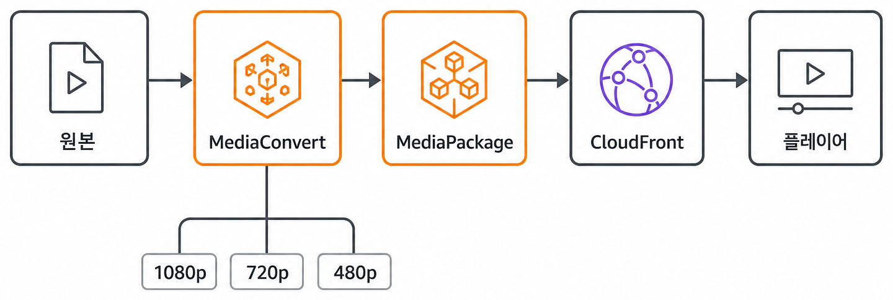
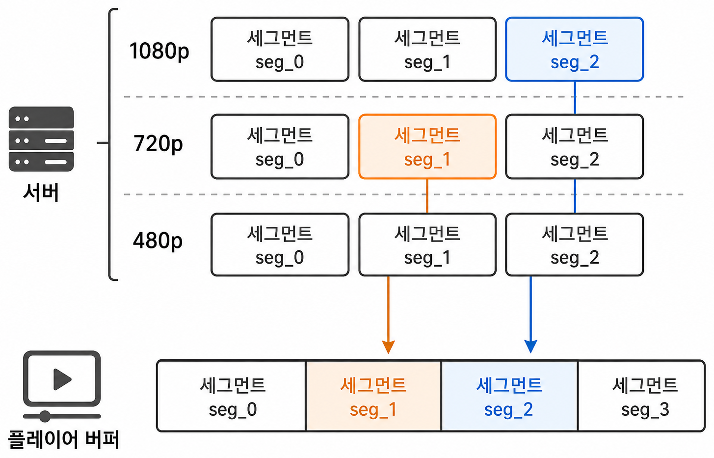
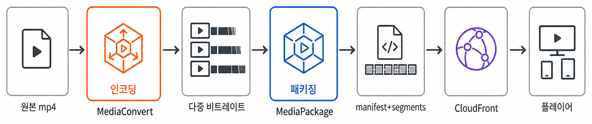

[영상이 어떻게 저장·재생되는지](/post/computer/media/video-basics)를 먼저 읽었다면, 이 글은 HLS와 DASH의 **manifest·세그먼트 구조**와 DRM 패키징 관점을 조금 더 깊게 다룬다.

---

### 적응형 스트리밍이란

네트워크 대역폭에 따라 **화질(비트레이트)을 바꿔가며** 끊김 없이 재생하는 방식이다. 원본 하나를 여러 비트레이트로 인코딩하고, 작은 **세그먼트** 단위로 쪼개 CDN에 올린다.



<br />

플레이어는 manifest를 보고 **세그먼트 단위**로 HTTP fetch한다. 재생 중 네트워크가 좋아지면 더 높은 화질의 다음 세그먼트를, 나빠지면 낮은 화질의 세그먼트를 골라 받는다. 예를 들어 1번 세그먼트는 720p에서, 2번 세그먼트는 1080p에서 가져오는 식으로 **화질이 섞여도** 시간 순서대로 이어 붙여 재생한다.



<br />

---

### 공통 개념

| 용어 | 설명 |
| --- | --- |
| **Manifest** | 재생 목록 파일 (어떤 세그먼트를 어떤 순서로 받을지) |
| **Segment** | 실제 영상·오디오 데이터 조각 (보통 수 초 단위) |
| **Representation / Variant** | 같은 콘텐츠의 서로 다른 비트레이트 버전 |
| **Init segment** | 코덱 정보 등 디코더 초기화에 필요한 데이터 |
| **Media segment** | 실제 미디어 프레임이 담긴 조각 |

DRM이 적용되면 세그먼트는 **암호화**되고, manifest에 **키 획득 방법**(EME init data, PSSH 등)이 포함된다.

---

### HLS (HTTP Live Streaming)

Apple이 제안한 방식으로, **m3u8** 플레이리스트와 **ts**(MPEG-TS) 또는 **fMP4** 세그먼트로 구성된다.

#### 구조

<Mermaid chart={`flowchart TB
  Master["master.m3u8"]
  V720["720p.m3u8"]
  V480["480p.m3u8"]
  S0["seg0.ts"]
  S1["seg1.ts"]
  Master --> V720
  Master --> V480
  V720 --> S0
  V720 --> S1`} />

<br />

#### 특징

- Safari·iOS에서 네이티브 지원이 강함
- FairPlay DRM과 함께 쓰이는 경우가 많음 (Widevine과 병행 시 CMAF/fMP4 사용)
- `#EXT-X-KEY` 태그로 세그먼트 암호화 정보를 명시

#### DRM 적용 시

```
#EXT-X-KEY:METHOD=SAMPLE-AES,URI="skd://...",KEYFORMAT="com.apple.streamingkeydelivery"
```

Widevine과 함께 쓸 때는 **fMP4 + SAMPLE-AES** 또는 **CMAF** 기반 패키징이 일반적이다.

---

### DASH (Dynamic Adaptive Streaming over HTTP)

MPEG 표준 기반. **MPD**(Media Presentation Description) XML manifest와 **fMP4** 세그먼트를 사용한다.

#### 구조

```xml
<!-- manifest.mpd (단순화) -->
<MPD>
  <Period>
    <AdaptationSet contentType="video">
      <Representation bandwidth="5000000" codecs="avc1.42E01E">
        <SegmentTemplate media="video-$Number$.m4s"
                           initialization="video-init.mp4"/>
      </Representation>
      <Representation bandwidth="2500000" ...>
        ...
      </Representation>
    </AdaptationSet>
  </Period>
</MPD>
```

#### 특징

- 표준화된 XML manifest로 화질·코덱·세그먼트 URL을 기술
- **CENC**(Common Encryption)와 Widevine·PlayReady 등 멀티 DRM에 적합
- MSE 기반 웹 플레이어와 궁합이 좋음

#### DRM 적용 시 — CENC + PSSH

DASH + Widevine에서는 세그먼트가 **CENC**로 암호화되고, init segment 또는 별도 박스에 **PSSH**(Protection System Specific Header)가 포함된다. EME 플레이어는 PSSH를 `initData`로 사용해 라이선스 서버에 키를 요청한다.

---

### HLS vs DASH 비교

| | HLS | DASH |
| --- | --- | --- |
| Manifest | m3u8 (텍스트) | MPD (XML) |
| 세그먼트 | ts / fMP4 | 주로 fMP4 (CMAF) |
| DRM | FairPlay 중심, Widevine 병행 가능 | CENC + Widevine에 적합 |
| 웹 재생 | Safari 네이티브, 그 외 MSE | MSE + DASH.js 등 |
| AWS | MediaPackage HLS 출력 | MediaPackage DASH 출력 |

PoC에서는 **둘 다 MediaPackage에서 출력**해 브라우저·디바이스 호환성을 비교했다.

---

### 인코딩·패키징 파이프라인에서의 위치



<br />

MediaConvert는 **인코딩**(비트레이트 래더 생성), MediaPackage는 **패키징**(manifest 생성·DRM 래핑·세그먼트 분할) 역할을 분담한다.

---

### PoC에서 배운 점

- **같은 원본**이라도 HLS/DASH manifest 구조가 달라 플레이어·디버깅 도구를 각각 준비해야 한다.
- DRM 적용 후에는 manifest만이 아니라 **init segment의 PSSH·키 ID**가 라이선스 서버와 일치해야 재생된다.
- CMAF(fMP4 기반)를 쓰면 HLS·DASH가 **같은 세그먼트 파일**을 공유할 수 있어 스토리지·CDN 비용을 줄일 수 있다.

---

### 요약

- **HLS**: m3u8 + ts/fMP4, Apple 생태계·호환성
- **DASH**: MPD + fMP4, CENC·Widevine과 표준적 조합
- 둘 다 적응형 스트리밍이며, AWS에서는 MediaConvert → MediaPackage → CloudFront 흐름으로 구축한다

---

### Ref.

- [Apple HLS Authoring Specification](https://developer.apple.com/documentation/http-live-streaming)
- [MPEG-DASH Specification](https://mpeg.chiariglione.org/standards/mpeg-dash)
- [AWS MediaPackage Documentation](https://docs.aws.amazon.com/mediapackage/)
- 본문 삽입 이미지(`adaptive-pipeline.png`, `segment-mixing.png`, `encode-package-position.png`)는 AI로 생성했다.
