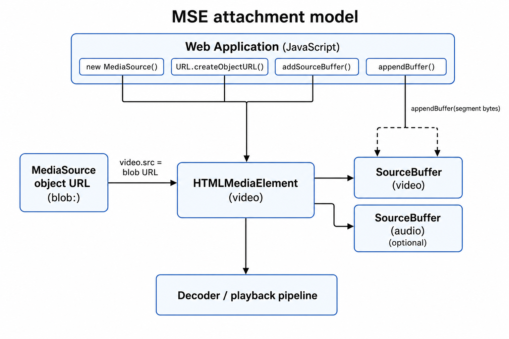
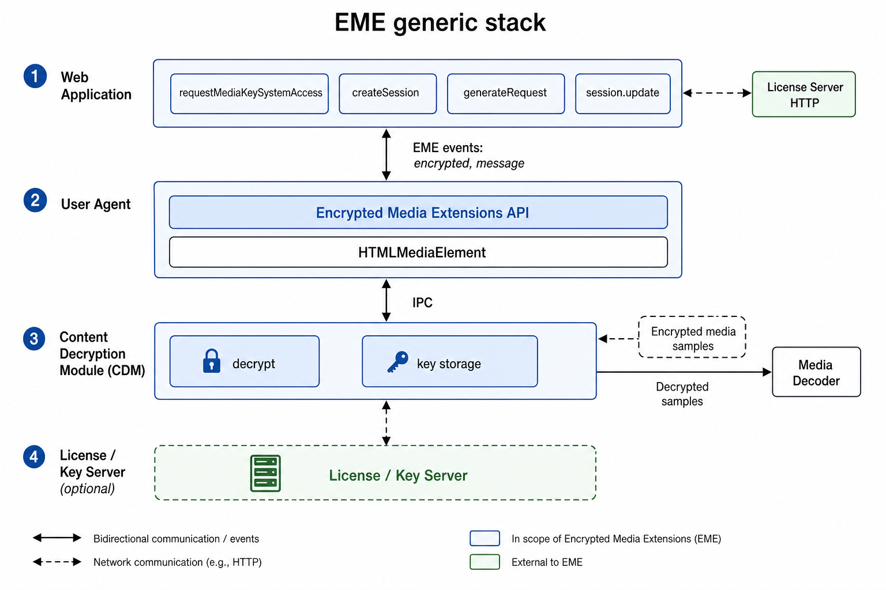
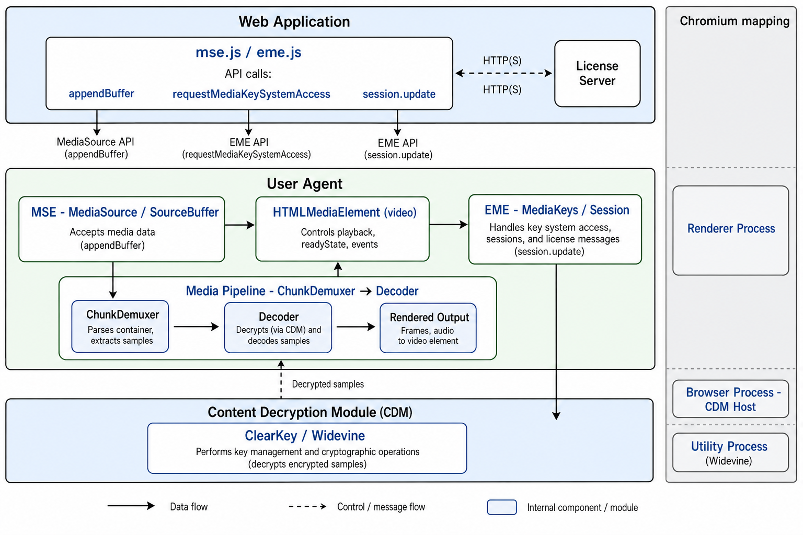

[영상 저장·재생과 HLS/DASH](/post/computer/media/video-basics), [HLS·DASH 패키징 구조](/post/computer/media/hls-dash)를 이해한 뒤, 브라우저에서 세그먼트 스트리밍과 DRM을 다루려면 **MSE**와 **EME** 두 API가 필요하다. 이 글은 데모 플레이어(`index.html` + `mse.js` + `eme.js`)를 만들며 정리한 내용이다.

---

### 왜 MSE·EME가 필요한가

HTML5 `<video src="movie.mp4">`는 **파일 URL 하나**를 브라우저에 넘기면 끝이다. 브라우저가 내부적으로 fetch → 디먹스 → 디코드 → 렌더링을 처리한다.

하지만 HLS/DASH처럼 **세그먼트를 나눠 받는 적응형 스트리밍**이나 **CENC 암호화 콘텐츠**는 이 모델로 맞추기 어렵다.

| API | 역할 |
| --- | --- |
| **MSE** (Media Source Extensions) | JavaScript가 미디어 바이트를 조각내어 `<video>`에 공급 |
| **EME** (Encrypted Media Extensions) | 암호화된 샘플의 키 요청·복호화를 CDM에 위임 |

DRM 재생의 기본 조합은 **MSE로 세그먼트를 받고, EME로 키를 맞춰 CDM이 복호화**하는 구조다.

---

### MSE란 무엇인가

MSE(Media Source Extensions)는 `<video>`의 `src`에 **파일 URL 대신 `MediaSource` 객체**를 연결해, JavaScript가 미디어 버퍼를 직접 조립하게 하는 API다.

#### 일반 재생과의 차이

| | 일반 `<video src>` | MSE |
| --- | --- | --- |
| 데이터 소스 | 서버의 단일 URL | JS가 만든 `MediaSource` |
| 버퍼 조립 | 브라우저가 fetch | JS가 `SourceBuffer.appendBuffer()` |
| 적응형 스트리밍 | 네이티브 HLS 등에 의존 | JS가 화질·세그먼트를 직접 선택 |

#### attachment 모델

[W3C MSE 2](https://www.w3.org/TR/media-source-2/)가 설명하는 부착(attach) 흐름은 다음과 같다.

1. `new MediaSource()`로 객체를 만든다.
2. `URL.createObjectURL(mediaSource)`로 **MediaSource object URL**(blob URL)을 만든다.
3. `video.src = objectURL`로 `HTMLMediaElement`에 연결한다.
4. 연결되면 `readyState`가 `closed` → `open`으로 바뀌고 `sourceopen` 이벤트가 발생한다.
5. `addSourceBuffer(mimeType)`로 트랙 버퍼를 만들고, `appendBuffer()`로 init segment·media segment를 순서대로 넣는다.
6. `<video>`는 재생 시점에 `MediaSource`에서 바이트를 가져와 디코더로 넘긴다.



<br />

`MediaSource.readyState`는 세 가지다.

| 상태 | 의미 |
| --- | --- |
| `closed` | 아직 `<video>`에 부착되지 않음 |
| `open` | 부착됨. `SourceBuffer`에 데이터 append 가능 |
| `ended` | `endOfStream()` 호출 후. 더 이상 append 불가 |

`appendBuffer`는 비동기다. `sourceBuffer.updating`이 `true`인 동안 또 append하면 예외가 난다.

---

### EME란 무엇인가

EME(Encrypted Media Extensions)는 MSE와 **별도 API**다. 암호화된 바이트가 `SourceBuffer`에 들어가면 `<video>`에서 `encrypted` 이벤트가 발생하고, 애플리케이션은 CDM(Content Decryption Module)과 대화해 복호화 키를 확보해야 한다.

[EME 2](https://www.w3.org/TR/encrypted-media-2/)가 제시하는 generic stack은 아래와 같다. 실제 호출 순서·이벤트 조합은 구현마다 달라질 수 있다.



<br />

| 계층 | 역할 |
| --- | --- |
| **Web Application** | `requestMediaKeySystemAccess`, 세션 생성, 라이선스 서버와 통신 |
| **User Agent** | EME API 구현, `encrypted`·`message` 이벤트 중개 |
| **CDM** | 키 저장, 라이선스 검증, 암호화 샘플 복호화 |

데모는 상용 Widevine 대신 `org.w3.clearkey`를 쓴다. ClearKey는 `message` 이벤트 후 JSON 키를 `session.update()`로 직접 넣을 수 있어 **MSE+EME 연동만 먼저 검증**하기 좋다. 프로덕션 Widevine은 같은 EME API 위에서 라이선스 서버 challenge/response를 거친다.

---

### 데모 흐름

데모 페이지는 최소한의 HTML에 스크립트 두 개만 로드한다. DOM에 `<video>`가 먼저 있고, JS가 로드되면서 `MediaSource`를 만들어 붙인다.

#### 페이지 부트스트랩

<Mermaid chart={`sequenceDiagram
  participant HTML as index.html
  participant DOM as DOM
  participant MSE as mse.js
  participant EME as eme.js
  participant Video as video element

  HTML->>DOM: video, log div 렌더
  HTML->>MSE: script src mse.js
  MSE->>DOM: querySelector video
  MSE->>MSE: new MediaSource
  MSE->>Video: src = createObjectURL
  Note over Video,MSE: attach → sourceopen
  HTML->>EME: script src eme.js
  EME->>DOM: querySelector video
  EME->>Video: encrypted 리스너 등록
  MSE->>MSE: MPD fetch, addSourceBuffer
  MSE->>Video: appendBuffer segments`} />

<br />

1. **HTML**: `<video>`와 로그용 `<div>`만 둔다. `src`는 비어 있다.
2. **mse.js**: `MediaSource`를 생성하고 `video.src = URL.createObjectURL(mediaSource)`로 DOM의 video에 연결한다.
3. **sourceopen**: DASH MPD를 fetch해 코덱 문자열을 읽고 init → media segment를 순차 append한다.
4. **eme.js**: 같은 `<video>`에 `encrypted` 리스너를 등록한다. `mse.js`가 파싱한 `type`·`codecs`를 키 시스템 설정에 재사용한다.
5. **재생**: 암호화 세그먼트 append 시 `encrypted`가 발생하고, EME 세션이 키를 맞춘 뒤 디코더가 프레임을 그린다.

#### mse.js — 세그먼트 append

`mse.js`는 Shaka Packager로 만든 `segmentDRM.mpd`를 직접 파싱하는 **최소 DASH 플레이어**다.

1. `sourceopen` → MPD fetch
2. `Representation`에서 `mimeType`, `codecs` 추출 → `addSourceBuffer`
3. `SegmentTemplate`에서 init·media URL 템플릿 읽기
4. init segment `appendBuffer` → `updateend`마다 `$Number$` media segment 순차 fetch
5. `updating`이 `false`일 때만 append. 실패 시 `sourceBuffer.remove`로 버퍼를 비우고 재시도

<Mermaid chart={`flowchart TB
  subgraph setup ["초기화"]
    direction LR
    O[sourceopen] --> P[MPD parse] --> S[addSourceBuffer]
  end
  subgraph seg ["세그먼트 루프"]
    direction LR
    I[init append] --> U[updateend]
    U --> F[fetch] --> A[appendBuffer]
    A --> U
  end
  setup --> I`} />

<br />

#### eme.js — ClearKey 세션

1. `encrypted` 발생 → `requestMediaKeySystemAccess("org.w3.clearkey", ...)`
2. `createMediaKeys` → `video.setMediaKeys`
3. `createSession` → `generateRequest("keyids", initData)` — HD Representation의 KID 사용
4. `message` → ClearKey JSON을 `session.update()` (라이선스 서버 없음)

MPD의 `cenc:default_KID`와 `eme.js`의 키 테이블이 일치해야 한다. HD KID `6d76f25c-...`는 hex `6d76f25cb17f5e16b8eaef6bbf582d8e`로 대응한다.

<Mermaid chart={`flowchart TB
  subgraph keys ["키 설정"]
    direction LR
    E[encrypted] --> R[requestAccess] --> M[setMediaKeys]
  end
  subgraph lic ["라이선스"]
    direction LR
    G[generateRequest] --> Msg[message] --> U[session.update] --> D[CDM decrypt]
  end
  keys --> lic`} />

<br />

#### MSE + EME 합쳐진 흐름

<Mermaid chart={`sequenceDiagram
  participant JS as "mse.js / eme.js"
  participant MSE as MediaSource
  participant Video as "video element"
  participant CDM as "ClearKey CDM"

  JS->>MSE: new MediaSource, sourceopen
  JS->>JS: MPD parse, addSourceBuffer
  JS->>MSE: appendBuffer init
  loop media segments
    JS->>MSE: appendBuffer segment
    MSE->>Video: encrypted event
    JS->>CDM: setMediaKeys, generateRequest
    CDM-->>JS: message
    JS->>CDM: session.update license
    CDM->>Video: decrypted samples
  end
  Video->>Video: decode / render`} />

<br />

MSE가 세그먼트를 밀어 넣고, EME가 키를 맞추는 두 축이 `updateend` / `encrypted` 이벤트로 맞물린다.

#### Widevine — EME 라이선스 (프로덕션)

ClearKey 데모는 `session.update()`에 JSON 키를 직접 넣지만, 프로덕션 **Widevine**은 라이선스 서버와 **challenge / response**를 거친다.

1. `encrypted` 이벤트 — MPD·init segment의 **PSSH**에서 `initData` 확보
2. `requestMediaKeySystemAccess("com.widevine.alpha", ...)`
3. `generateRequest` — CDM이 만든 **challenge**를 애플리케이션이 라이선스 서버에 POST
4. 라이선스 서버가 **Widevine license binary** 응답
5. `session.update(license)` — CDM이 키를 등록하고 복호화 시작

패키징 단계에서 MediaPackage가 SPEKE로 받은 **key ID**와 EME `initData`의 KID가 같아야 한다. 패키징 쪽 SPEKE·CPIX 키 교환은 [AWS DRM 파이프라인](/post/computer/aws/media-streaming-drm)의 MediaPackage 절을 참고한다. EME 쪽은 **binary license** 응답 형식이 맞는지, `keyStatuses`가 `usable`이 되는지가 핵심이다.

| | ClearKey (데모) | Widevine (프로덕션) |
| --- | --- | --- |
| Key System | `org.w3.clearkey` | `com.widevine.alpha` |
| `session.update` | JSON 키 직접 전달 | 라이선스 서버 binary 응답 |
| 키 출처 | `eme.js` 하드코딩 | SPEKE 패키징 + 라이선스 서버 |

디버깅 시 자주 막히는 지점은 다음과 같다.

- MPD `codecs` 문자열과 `addSourceBuffer` 인자 불일치 → `sourceopen` 직후 실패
- `updating` 체크 없이 연속 `appendBuffer` → 예외
- KID 불일치 → `session.update` 후에도 키가 `usable`이 되지 않음

---

### 코드 예시와 브라우저 구조

[EME 2](https://www.w3.org/TR/encrypted-media-2/)는 API를 쓰는 전형적인 스택을 **Web Application → User Agent → CDM** 세 계층으로 그린다. [MSE 2](https://www.w3.org/TR/media-source-2/)는 같은 User Agent 안에서 `MediaSource`가 `HTMLMediaElement`에 부착되고, `SourceBuffer`로 세그먼트가 들어가는 모델을 설명한다. 데모는 두 API를 한 `<video>`에 동시에 얹는 형태다.



<br />

#### W3C 계층별 역할

| 계층 | 구성 | 데모에서의 예 |
| --- | --- | --- |
| **Web Application** | MSE·EME API를 호출하는 JavaScript | `mse.js`, `eme.js` |
| **Web Application** | 라이선스 서버와 HTTP 통신 | ClearKey는 `session.update()`로 키 JSON 직접 전달. Widevine은 challenge/response |
| **User Agent** | MSE — `MediaSource`, `SourceBuffer` | `appendBuffer`로 DASH 세그먼트 조립 |
| **User Agent** | `HTMLMediaElement` | `<video>` 재생·`encrypted` 이벤트 발생 |
| **User Agent** | EME — `MediaKeys`, `MediaKeySession` | `requestMediaKeySystemAccess`, `generateRequest` |
| **User Agent** | Media Pipeline — Demuxer, Decoder | fMP4 파싱·H.264 디코드 (브라우저 내부) |
| **CDM** | Content Decryption Module | ClearKey / Widevine. CENC 샘플 복호화 |

W3C 관점에서 **MSE는 데이터 경로**, **EME는 키 경로**다. 암호화 콘텐츠는 MSE로 세그먼트를 넣고, EME로 CDM에 키를 넘긴 뒤, CDM이 복호화한 샘플이 Media Pipeline을 통해 `<video>`로 간다.

<Mermaid chart={`flowchart TB
  subgraph app ["Web Application"]
    direction LR
    JS["mse.js / eme.js"]
    LS["License Server"]
  end
  subgraph ua ["User Agent"]
    direction LR
    MSE["MSE"] --> PIPE["Demux / Decode"] --> VID["video"]
    EME["EME"] --> VID
  end
  subgraph cdm ["CDM"]
    CDM["ClearKey / Widevine"]
  end
  JS --> MSE
  JS --> EME
  JS <-.-> LS
  EME --> CDM
  CDM -.-> PIPE`} />

<br />

#### Chromium 프로세스 매핑

W3C는 구현체가 CDM을 User Agent와 분리할 수 있다고만 말한다. Chromium은 이 계층을 **프로세스 경계**로 나눈다.

| W3C 계층 | Chromium | 비고 |
| --- | --- | --- |
| Web Application | Renderer Process (Blink JS) | `mse.js` / `eme.js` 실행 위치 |
| User Agent (MSE·EME API) | Renderer Process (Blink) | `MediaSource`, `MediaKeys` 바인딩 |
| User Agent (Media Pipeline) | Renderer Process | `ChunkDemuxer`, `Decoder` |
| CDM Host | Browser Process | EME IPC 중개 |
| CDM Module | Renderer 또는 Utility Process | ClearKey는 비교적 단순. **Widevine은 Utility 샌드박스** |

| | ClearKey | Widevine |
| --- | --- | --- |
| Key System | `org.w3.clearkey` | `com.widevine.alpha` |
| 용도 | 스펙 학습·파이프라인 디버깅 | 상용 DRM |
| CDM 위치 | 비교적 단순한 경로 | Utility 프로세스 샌드박스 |
| 라이선스 | JSON 키를 `update()`로 직접 전달 | 라이선스 서버 challenge/response |
| 데모 | `eme.js` | 이후 AWS MediaPackage PoC |

#### 데모 소스 코드

<CodeAccordion title="index.html — video 요소와 스크립트 로드">

```html
<!DOCTYPE html>
<html lang="en">
    <head>
        <meta charset="UTF-8" />
        <meta http-equiv="X-UA-Compatible" content="IE=edge" />
        <meta name="viewport" content="width=device-width, initial-scale=1.0" />
        <title>Document</title>
    </head>
    <body>
        <video id="v" class="vid" autoplay controls></video>

        <div id="log"></div>

        <script src="./mse.js"></script>
        <script src="./eme.js"></script>

        <style>
            .vid {
                width: 80vw;
                height: 80vh;
            }
        </style>
    </body>
</html>
```

</CodeAccordion>

<CodeAccordion title="mse.js — MediaSource 부착과 DASH 세그먼트 append">

```javascript
"use strict";

const IP = "172.31.197.243";

const BASE_URL = `http://${IP}:8080/`;
const MPD_FILE = "segmentDRM.mpd";

let logElement = document.getElementById("log");

let type, codecs, width, height, bandwidth;
let timescale, init, mediaFormat, startNum, chuckCnt;
let time = [],
    duration = [],
    repeat = [];

let playIdx = 0;

let mediaSource, videoElement, sourceBuffer;

const log = (obj) => {
    console.log(obj);
    logElement.innerHTML += `<br> ` + obj;
};

const request = async (url, type, callback, isLog) => {
    if (url === "") return;

    if (isLog) log(`[Request] ${url} ${type}`);

    let xhr = new XMLHttpRequest();
    xhr.open("GET", url, true);
    xhr.responseType = type;

    xhr.onload = (e) => {
        if (xhr.status != 200) {
            log("[Error] Get Error: " + xhr.statusText);
            return false;
        }
        callback(xhr.response);
    };

    xhr.send();
};

const appendToBuffer = async (videoChunk) => {
    try {
        if (!sourceBuffer.updating) {
            if (videoChunk) {
                sourceBuffer.appendBuffer(new Uint8Array(videoChunk));
            }
        }
    } catch {
        sourceBuffer.remove(0, 30);
        await appendToBuffer(videoChunk);
    }
};

const nextSegment = async () => {
    let url = BASE_URL + mediaFormat.replace("$Number$", playIdx);
    request(url, "arraybuffer", appendToBuffer, false);
    playIdx++;
    if (playIdx > chuckCnt) {
        sourceBuffer.removeEventListener("updateend", nextSegment);
    }
};

const parseNplay = async (textXML) => {
    log("[Parse] Parsing .mpd file...");

    let parser = new DOMParser();
    let xmlData = parser.parseFromString(textXML, "text/xml");

    let rep = xmlData.querySelectorAll("Representation");
    type = rep[1].getAttribute("mimeType");
    codecs = rep[1].getAttribute("codecs");
    width = rep[1].getAttribute("width");
    height = rep[1].getAttribute("height");
    bandwidth = rep[1].getAttribute("bandwidth");

    let segTemplate = xmlData.querySelectorAll("SegmentTemplate");
    timescale = segTemplate[1].getAttribute("timescale");
    init = segTemplate[1].getAttribute("initialization");
    mediaFormat = segTemplate[1].getAttribute("media");
    startNum = segTemplate[1].getAttribute("startNumber");
    playIdx = startNum;

    let timeline = xmlData.querySelectorAll("SegmentTimeline")[0].children;
    chuckCnt = 0;

    for (let idx = 0; idx < timeline.length; idx++) {
        const element = timeline[idx];

        let t = Number(element.getAttribute("t"));
        let d = Number(element.getAttribute("d"));
        let r = Number(element.getAttribute("r"));

        time.push(t);
        duration.push(d);
        repeat.push({ idx, r });

        chuckCnt += r ? r + 1 : 1;
    }

    log(`${type}; codecs="${codecs}"`);

    sourceBuffer = mediaSource.addSourceBuffer(`${type}; codecs="${codecs}"`);
    sourceBuffer.addEventListener("updateend", nextSegment);

    request(BASE_URL + init, "arraybuffer", appendToBuffer, true);

    let playPromise = videoElement.play();

    if (playPromise !== undefined) {
        playPromise
            .then((_) => {
                videoElement.pause();
            })
            .catch((error) => log);
    }
};

const onSourceOpen = async () => {
    request(BASE_URL + MPD_FILE, "text", parseNplay, true);
};

videoElement = document.querySelector("video");
mediaSource = new MediaSource();

videoElement.src = window.URL.createObjectURL(mediaSource);
mediaSource.addEventListener("sourceopen", onSourceOpen);
```

</CodeAccordion>

<CodeAccordion title="eme.js — ClearKey EME 세션">

```javascript
"use strict";

const KEYSYSTEM_TYPE = "org.w3.clearkey";

let video = document.querySelector("video");
let options = [];

let keys = {};

let count = 1;

video.sessions = [];

const Base64ToHex = (str) => {
    let bin = window.atob(str.replace(/-/g, "+").replace(/_/g, "/"));
    let res = "";
    for (let i = 0; i < bin.length; i++) {
        res += ("0" + bin.charCodeAt(i).toString(16)).substr(-2);
    }
    return res;
};

const HexToBase64 = (hex) => {
    let bin = "";
    for (let i = 0; i < hex.length; i += 2) {
        bin += String.fromCharCode(parseInt(hex.substr(i, 2), 16));
    }
    return window
        .btoa(bin)
        .replace(/=/g, "")
        .replace(/\+/g, "-")
        .replace(/\//g, "_");
};

const createEnsureKey = async () => {
    log("[Create MediaKeys Object]");

    const keySystemAccess = await navigator.requestMediaKeySystemAccess(
        "org.w3.clearkey",
        [
            {
                initDataTypes: ["cenc"],
                videoCapabilities: [
                    { contentType: `${type}; codecs="${codecs}"` },
                ],
            },
        ]
    );
    const mediaKeys = await keySystemAccess.createMediaKeys();
    return await video.setMediaKeys(mediaKeys);
};

const handleMessage = (event) => {
    log("[Message] Session Update " + String(count++));

    var keySession = event.target;
    var te = new TextEncoder();
    var license = te.encode(
        `{"keys":[{"kty":"oct","k":"${HexToBase64(
            "cb541084c99731aef4fff74500c12ead"
        )}","kid":"${HexToBase64("6d76f25cb17f5e16b8eaef6bbf582d8e")}"}]}`
    );
    keySession
        .update(license)
        .catch(console.error.bind(console, "update() failed"));
};

if (!navigator.requestMediaKeySystemAccess) {
    log(
        "EME API is not supported. Enable pref media.eme.enabled to true in about:config"
    );
}

keys["abba271e8bcf552bbd2e86a434a9a5d9"] = "69eaa802a6763af979e8d1940fb88392"; // SD
keys["6d76f25cb17f5e16b8eaef6bbf582d8e"] = "cb541084c99731aef4fff74500c12ead"; // HD

video.addEventListener("encrypted", (e) => {
    log("Encrypted Video");

    createEnsureKey().then(() => {
        var te = new TextEncoder();
        var initData = te.encode(
            `{"kids":["${HexToBase64("6d76f25cb17f5e16b8eaef6bbf582d8e")}"]}`
        );

        var keySession = video.mediaKeys.createSession();
        keySession.addEventListener("message", handleMessage);
        return keySession.generateRequest("keyids", initData);
    });
});
```

</CodeAccordion>

---

### Ref.

- [Media Source Extensions™ 2 — W3C](https://www.w3.org/TR/media-source-2/)
- [Encrypted Media Extensions™ 2 — W3C](https://www.w3.org/TR/encrypted-media-2/)
- [Chromium — Encrypted Media (EME)](https://www.chromium.org/developers/design-documents/encrypted-media/)
- [AWS로 Widevine DRM 스트리밍 파이프라인 구축하기](/post/computer/aws/media-streaming-drm)
- [Google Widevine DRM](https://www.widevine.com/)
- 본문 삽입 이미지(`mse-attachment.png`, `eme-stack.png`, `browser-stack.png`)는 W3C MSE 2·EME 2 스펙 다이어그램 구조를 참고해 AI로 생성했다.
