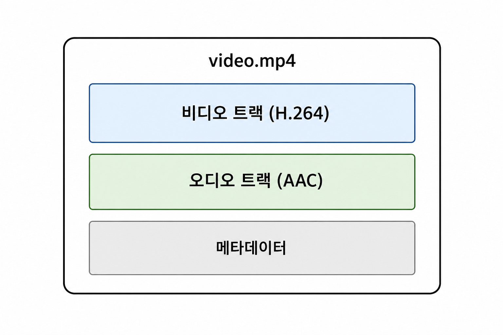
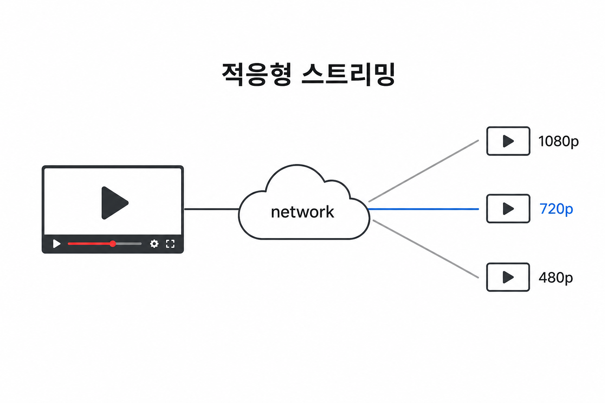
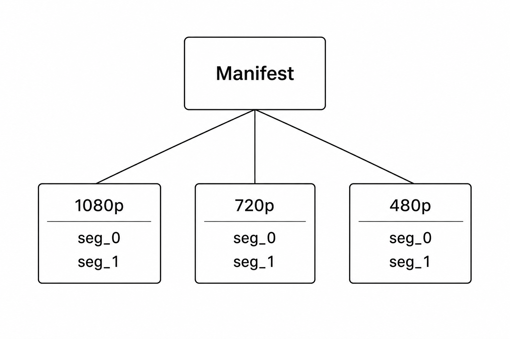

Widevine DRM PoC에 들어가기 전, **영상이 파일로 어떻게 저장되는지**, **화면에 어떻게 나오는지**, **HLS·DASH가 왜 필요한지**부터 정리했다. 브라우저 API(MSE·EME)나 AWS 파이프라인은 이후 글에서 다룬다.

---

### 영상의 본질 — 프레임의 연속

디지털 영상은 본질적으로 **짧은 시간 간격으로 잘린 정지 이미지(프레임)** 를 빠르게 이어 보여 주는 것이다.

| 용어 | 설명 |
| --- | --- |
| **프레임(Frame)** | 한 순간의 이미지 (픽셀 배열) |
| **프레임레이트(FPS)** | 초당 프레임 수 (24, 30, 60 등) |
| **해상도** | 프레임의 가로×세로 픽셀 (1920×1080 등) |
| **비트레이트** | 초당 전송·저장되는 데이터량 (Mbps 등) |

1분짜리 1080p 30fps 원본을 압축하지 않고 저장하면 용량이 기가바이트 단위로 커진다. 그래서 **코덱**으로 압축한다.

---

### 코덱과 컨테이너

영상 파일을 이해하려면 **코덱**과 **컨테이너**를 구분해야 한다.

#### 코덱 (Codec)

영상·오디오 데이터를 **압축·해제**하는 알고리즘이다.

| 종류 | 예시 | 역할 |
| --- | --- | --- |
| 비디오 코덱 | H.264 (AVC), H.265 (HEVC), VP9, AV1 | 픽셀 데이터 압축 |
| 오디오 코덱 | AAC, MP3, Opus | 소리 데이터 압축 |

코덱은 "어떤 규칙으로 바이트를 프레임으로 되돌릴지"만 정의한다. 파일 안에서 어디에 무엇이 있는지는 **컨테이너**가 담당한다.

#### 컨테이너 (Container)

비디오 트랙, 오디오 트랙, 자막, 메타데이터를 **하나의 파일**에 담는 껍데기다.

| 컨테이너 | 확장자 | 특징 |
| --- | --- | --- |
| MP4 | `.mp4`, `.m4s` | 가장 흔함, 스트리밍·다운로드 모두 사용 |
| MPEG-TS | `.ts` | HLS에서 전통적으로 쓰이는 세그먼트 형식 |
| MKV | `.mkv` | 유연하지만 웹 스트리밍에는 덜 쓰임 |

 

---

### 영상이 화면에 나오기까지

로컬 파일 하나를 재생할 때의 흐름은 다음과 같다.

 

#### 각 단계 설명

1. **디먹싱**: MP4 안에서 비디오 트랙 바이트와 오디오 트랙 바이트를 분리한다.
2. **디코딩**: H.264 디코더가 압축된 NAL 유닛을 YUV 픽셀 프레임으로, AAC 디코더가 압축 오디오를 PCM으로 바꾼다.
3. **동기화**: 각 프레임·샘플에는 **PTS**(Presentation Timestamp)가 있어, 몇 초에 보여 줄지 맞춘다.
4. **렌더링**: 디코딩된 프레임을 `<video>` 요소나 OS 미디어 파이프라인이 화면에 그린다.

브라우저에서 `<video src="movie.mp4">` 한 줄로 재생되는 것은, 브라우저가 위 과정을 **내부적으로** 처리하기 때문이다.

---

### 프로그레시브 다운로드 vs 스트리밍

#### 프로그레시브 다운로드 (Progressive Download)

파일 전체를 (또는 앞부분부터 순서대로) 받으면서 재생한다. 일반 MP4 하나를 CDN에 올려 `<video src>`로 재생하는 방식이다.

- 구현이 단순하다
- **화질 전환 불가** — 파일 하나당 비트레이트가 고정
- 긴 영상·모바일 네트워크에서는 버퍼링이 잦을 수 있다

#### 스트리밍 (Streaming)

영상을 **작은 조각(세그먼트)** 으로 나누고, 네트워크 상태에 따라 **다른 화질의 세그먼트**를 골라 받으며 재생한다. 이를 **적응형 스트리밍(Adaptive Bitrate Streaming)** 이라 한다.

 

웹에서 적응형 스트리밍을 하려면 브라우저가 세그먼트를 직접 이어 붙일 수 있어야 하는데, 이를 위해 **MSE**(Media Source Extensions)가 필요하다. MSE는 [다음 글](/post/computer/media/mse-eme)에서 다룬다.

---

### HLS와 DASH — 적응형 스트리밍 프로토콜

HLS와 DASH는 **영상 데이터 자체의 포맷이 아니라**, 세그먼트를 어떻게 나누고 플레이어에게 어떤 순서로 받을지 알려 주는 **전달 규약(프로토콜)** 이다.

| | HLS | DASH |
| --- | --- | --- |
| 제안 주체 | Apple | MPEG 표준 |
| 재생 목록 | `.m3u8` (텍스트) | `.mpd` (XML) |
| 세그먼트 | `.ts` 또는 fMP4 | 주로 fMP4 |
| 대표 사용처 | iOS·Safari, IPTV | Android·웹(MSE) |

둘 다 구조는 비슷하다.

 

1. 플레이어가 **manifest**를 먼저 받는다.
2. manifest에 적힌 URL로 **세그먼트**를 HTTP로 fetch한다.
3. 받은 세그먼트를 디코딩해 화면에 출력한다.
4. 네트워크가 느려지면 manifest에 있는 **더 낮은 비트레이트** 세그먼트로 전환한다.

#### 왜 두 가지나 있는가

역사·플랫폼 차이 때문이다. Apple 생태계는 HLS가 기본이고, 웹 표준·안드로이드 쪽은 DASH가 널리 쓰인다. 실무에서는 **같은 인코딩 결과물을 HLS·DASH manifest 둘 다로 패키징**해 호환성을 맞추는 경우가 많다.

manifest 구조·DRM 적용·세그먼트 포맷 세부는 [HLS와 DASH — 적응형 스트리밍 포맷 이해하기](/post/computer/media/hls-dash)에서 이어서 다룬다.

---

### 저장부터 재생까지 — 전체 그림

 

DRM이 붙으면 세그먼트가 **암호화**되고, 재생 전 **라이선스 서버에서 키**를 받아야 한다. 이 부분은 [MSE와 EME](/post/computer/media/mse-eme) → [AWS DRM 파이프라인](/post/computer/aws/media-streaming-drm) 순으로 정리했다.

---

### 요약

- 영상은 **프레임**의 연속이며, **코덱**으로 압축하고 **컨테이너**에 담아 저장한다
- 재생은 **디먹싱 → 디코딩 → 동기화 → 렌더링** 순이다
- **HLS·DASH**는 세그먼트 단위 적응형 스트리밍을 위한 프로토콜이며, manifest + 세그먼트 구조를 가진다
- 웹에서 세그먼트 스트리밍·DRM을 다루려면 MSE·EME 이해가 이어진다

---

### Ref.

- [HLS와 DASH — 적응형 스트리밍 포맷 이해하기](/post/computer/media/hls-dash)
- [MSE와 EME — 브라우저에서 암호화 미디어 재생하기](/post/computer/media/mse-eme)
- [Apple HLS Overview](https://developer.apple.com/streaming/)
- [MPEG-DASH Overview](https://mpeg.chiariglione.org/standards/mpeg-dash)
- 본문 삽입 이미지(`container.png`, `playback-pipeline.png`, `adaptive-streaming.png`, `manifest-structure.png`, `end-to-end.png`)는 AI로 생성했다.
