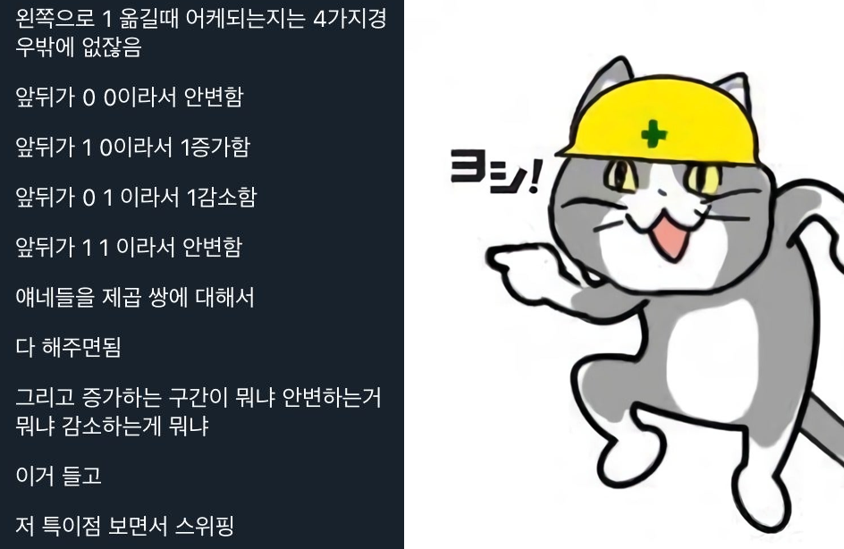

## 문제집

한국정보올림피아드 시.도 지역본선 2005 - [https://www.acmicpc.net/category/72](https://www.acmicpc.net/category/72)

### 초등부

---

#### 1. 대표값2 - 2587

구현

#### 2. 곱셈 - 2588

이것도 구현

#### 3. 보물섬 - 2589

BFS

#### 4. 색종이 - 2590

조건 분기 - 크기가 큰 종이부터 차례대로 넣고 남는 공간에 크기가 작은 종이를 넣을 수 있는지 계산했다.

#### 5. 숫자카드 - 2591

카드로 바꿀 수 있는 수가 34 이하인 것을 주의하자.

<CH.Code>

```cpp 2587.cpp
#include <bits/stdc++.h>
using namespace std;
#define fastio                                                                 \
  ios::sync_with_stdio(false);                                                 \
  cin.tie(0);
#define endl '\n'

int main(void) {
  fastio;

  int sum = 0;
  vector<int> arr;
  for (int i = 0; i < 5; i++) {
    int t;
    cin >> t;
    sum += t;
    arr.push_back(t);
  }

  cout << sum / 5 << endl;
  sort(arr.begin(), arr.end());
  cout << arr[2] << endl;

  return 0;
}
```

```py 2588.py
n1 = int(input())
n2 = list(map(int, list(str(input()))))
result = 0

for i in range(3):
    print(n1 * n2[2-i])
    result += n1 * n2[2-i] * (10**i)

print(result)
```

```cpp 2589.cpp
#include <bits/stdc++.h>
#define FastIO ios::sync_with_stdio(false);
#define endl    '\n'
using namespace std;

int height, width, ans = 0;
int dy[4] = {1,0,-1,0};
int dx[4] = {0,1,0,-1};
vector<vector<char>> board;
vector<vector<int>> mask;

void init()
{
    mask.clear();
    mask.resize(height, vector<int> (width, 0));
}

void search(pair<int,int> pos)
{
    queue<pair<int, int>> q;
    q.push(pos);
    mask[pos.first][pos.second] = 1;
    while (!q.empty())
    {
        pair<int, int> cur = q.front();
        q.pop();
        ans = max(mask[cur.first][cur.second], ans);

        for (int i = 0; i < 4; i++)
        {
            int ny = cur.first + dy[i];
            int nx = cur.second + dx[i];
            
            if(ny < 0 || ny >= height || nx < 0 || nx >= width || board[ny][nx] == 'W' || mask[ny][nx]) continue;

            q.push(make_pair(ny, nx));
            mask[ny][nx] = mask[cur.first][cur.second] + 1;
        }
    }
    

}

void solve()
{
    cin >> height >> width;
    board.resize(height, vector<char> (width));
    init();

    for (int i = 0; i < height; i++)
    {
        for (int j = 0; j < width; j++)
            cin >> board[i][j];
    }

    for (int i = 0; i < height; i++)
    {
        for (int j = 0; j < width; j++)
        {
            if(board[i][j] == 'L')
            {
                search(make_pair(i, j));
                init();
            }
        }
        
    }
    
    cout << ans - 1 << endl;
}

int main () 
{
    FastIO;

    solve();

    return 0;
}
```

```cpp 2590.cpp
#include <bits/stdc++.h>
using namespace std;
#define fastio                                                                 \
  ios::sync_with_stdio(false);                                                 \
  cin.tie(0);
#define endl '\n'

int main(void) {
  fastio;

  vector<int> cnt(7, 0);
  for (int i = 0; i < 6; i++) {
    cin >> cnt[i + 1];
  }

  int ans = cnt[6];

  // 5 - 1
  ans += cnt[5];
  cnt[1] -= cnt[5] * 11;

  // 4 - 2 - 1
  ans += cnt[4];
  cnt[2] -= cnt[4] * 5;
  if (cnt[2] < 0) {
    cnt[1] -= cnt[2] * -4;
    cnt[2] = 0;
  }

  //  3 - 2 - 1
  ans += cnt[3] / 4;
  cnt[3] = cnt[3] % 4;
  if (cnt[3] != 0) {
    ans++;
    int possible2 = (4 - cnt[3]) * 2 - 1;
    int draw2 = min(cnt[2], possible2);
    cnt[2] -= draw2;
    cnt[1] -= 36 - draw2 * 4 - cnt[3] * 9;
  }

  // 2 - 1
  if (cnt[2] > 0) {
    ans += cnt[2] / 9;
    cnt[2] = cnt[2] % 9;

    if (cnt[2] != 0) {
      ans++;
      cnt[1] -= 36 - cnt[2] * 4;
    }
  }

  // 1
  if (cnt[1] > 0) {
    ans += cnt[1] / 36;
    if (cnt[1] % 36 != 0) {
      ans++;
    }
  }

  cout << ans << endl;
  return 0;
}
```

```cpp 2591.cpp
#include <bits/stdc++.h>
using namespace std;
#define fastio                                                                 \
  ios::sync_with_stdio(false);                                                 \
  cin.tie(0);
#define endl '\n'

int solve(vector<int> &cache, string &s, int start) {

  if (start >= s.length())
    return 1;

  if (s[start] == '0')
    return 0;

  if (cache[start] != -1)
    return cache[start];

  int ret = solve(cache, s, start + 1);

  if (start + 1 < s.length()) {
    int val = (s[start] - '0') * 10 + (s[start + 1] - '0');
    if (0 < val && val <= 34) {
      ret += solve(cache, s, start + 2);
    }
  }

  cache[start] = ret;
  return ret;
}

int main(void) {
  fastio;

  string s;
  cin >> s;

  vector<int> cache(s.length(), -1);

  cout << solve(cache, s, 0);

  return 0;
}
```

</CH.Code>


### 중등부

---

#### 1. 대표값 - 2592

구현

#### 2. 색종이 - 2590

초등부 4번

#### 3. 숫자카드 - 2591

초등부 5번

#### 4. 엘리베이터 - 2593

각 층에서 사용할 수 있는 엘리베이터와 각 엘리베이터에서 이동할 수 있는 층을 이용해서 그래프 탐색을 했다.
한번 사용한 엘리베이터는 다시 사용하지 않는 것을 생각하자.

#### 5. 화물열차 - 1665

구간의 개수는 적고, 구간의 범위는 넓어서 개수로 어떻게 처리가 안될까? 라는 생각만 가지고 끙끙대고 있었는데, [지나가던 행인이](https://github.com/skeep194) 답을 알려줬다. 좋았쓰!

<br/>



<br/>

<CH.Code>

```cpp 2592.cpp
#include <bits/stdc++.h>
using namespace std;
#define fastio                                                                 \
  ios::sync_with_stdio(false);                                                 \
  cin.tie(0);
#define endl '\n'

int main(void) {
  fastio;

  int sum = 0;
  vector<int> arr(101, 0);
  for (int i = 0; i < 10; i++) {
    int t;
    cin >> t;
    sum += t;
    arr[t / 10]++;
  }

  cout << sum / 10 << endl;

  int mx = -1, ans = -1;
  for (int i = 0; i <= 100; i++) {
    if (mx < arr[i]) {
      ans = i;
      mx = arr[i];
    }
  }

  cout << ans * 10 << endl;

  return 0;
}
```

```cpp 2593.cpp
#include <bits/stdc++.h>
using namespace std;
#define fastio                                                                 \
  ios::sync_with_stdio(false);                                                 \
  cin.tie(0);
#define endl '\n'

int main(void) {
  fastio;

  int n, m;
  cin >> n >> m;

  vector<vector<int>> elevator(m + 1, vector<int>());
  vector<vector<int>> floor(n + 1, vector<int>());

  for (int i = 0; i < m; i++) {
    int st, gap;
    cin >> st >> gap;

    for (int j = st; j <= n; j += gap) {
      elevator[i + 1].push_back(j);
      floor[j].push_back(i + 1);
    }
  }

  int start, end;
  cin >> start >> end;

  queue<pair<int, pair<int, int>>> q;
  vector<int> dist(n + 1, INT_MAX), visitedElev(m + 1, false);
  vector<pair<int, int>> trace(n + 1, {-1, -1});
  dist[start] = 0;
  trace[start] = {-1, -1};
  q.push({0, {start, -1}});

  while (!q.empty()) {

    auto [step, info] = q.front();
    auto [cur, eleIdx] = info;
    q.pop();

    for (int elev : floor[cur]) {

      if (visitedElev[elev]) {
        continue;
      }
      visitedElev[elev] = true;

      for (int nextFloor : elevator[elev]) {

        if (dist[nextFloor] > step + 1) {

          dist[nextFloor] = step + 1;
          trace[nextFloor] = {cur, elev};

          q.push({step + 1, {nextFloor, elev}});
        }
      }
    }
  }

  if (dist[end] == INT_MAX) {
    cout << -1 << endl;
  } else {

    cout << dist[end] << endl;

    int cur = end;
    vector<int> route;
    while (cur != -1) {
      route.push_back(trace[cur].second);
      cur = trace[cur].first;
    }

    for (int i = dist[end] - 1; i >= 0; i--) {
      cout << route[i] << endl;
    }
  }

  return 0;
}
```

```cpp 1665.cpp
#include <bits/stdc++.h>
using namespace std;
#define fastio                                                                 \
  ios::sync_with_stdio(false);                                                 \
  cin.tie(0);
#define endl '\n'

int main(void) {
  fastio;

  int n, m;
  cin >> n;
  vector<pair<long long, long long>> trainA, trainB;
  for (int i = 0; i < n; i++) {
    long long x, y;
    cin >> x >> y;
    trainA.push_back({x, y});
  }

  cin >> m;
  for (int i = 0; i < m; i++) {
    long long x, y;
    cin >> x >> y;
    trainB.push_back({x, y});
  }

  // moveCnt, flag;
  vector<pair<long long, long long>> section;

  for (int i = 0; i < n; i++) {
    for (int j = 0; j < m; j++) {
      // startA + startB : 구간 시작
      section.push_back({trainA[i].first + trainB[j].first - 1, 1});

      // startA + endB : 최대 구간 (더 이상 화물이 추가되지 않음)
      section.push_back({trainA[i].first + trainB[j].second, -1});

      // endA + startB : 감소 구간 시작 (trainB가 trainA를 지나치기 시작)
      section.push_back({trainA[i].second + trainB[j].first, -1});

      // endA + endB : 구간 끝
      section.push_back({trainA[i].second + trainB[j].second + 1, 1});
    }
  }

  sort(section.begin(), section.end());

  // sweep
  long long curPack = 0, curMove = 0, overlap = 0;
  pair<long long, long long> ans = {0, 0};

  for (auto [moveCnt, flag] : section) {
    curPack += overlap * (moveCnt - curMove);
    overlap += flag, curMove = moveCnt;
    if (ans.first < curPack) {
      ans = {curPack, curMove};
    }
  }

  cout << ans.second - 1 << endl;

  return 0;
}
```

</CH.Code>

### 고등부

---

#### 1. 대표값 - 2592

중등부 1번 

#### 2. 놀이공원 - 2594

구현

#### 3. 로봇 - 1726

BFS인데, 방향바라보고 있는 방향을 주의해서 구현하자.

#### 4. 화물열차 - 1665

중등부 5번

#### 5. 배수 - 2595

1로만 이루어진 수를 $x$로 나눈다고 생각해보자.

$$
\begin{align}
1111111\ \%\ x &= x_{1} \\
11111111\ \%\ x &= x_{2} \\
111111111\ \%\ x &= x_{3} \\
\vdots \\
111111111\dots\ \%\ x &= x_{n}
\end{align} 
$$

$x_{n} < x$이고, 1로 이루어진 수는 무한히 존재한다. 

여기서, 같은 나머지를 가지는 수 2개를 서로 빼면 
$1111111111\dots - 111111 = 11 \dots 1111000000$ 이고, 2개의 숫자(1과 0)로 이루어진 $x$의 배수는 존재한다.

<br />

이 생각에 기초해서 2개의 숫자를 고르고, 그 숫자로 이루어지고 같은 나머지를 가진 2개의 수를 찾았다.

<CH.Code>

```cpp 2594.cpp

#include <bits/stdc++.h>
using namespace std;
#define fastio                                                                 \
  ios::sync_with_stdio(false);                                                 \
  cin.tie(0);
#define endl '\n'

int strToMin(string t) {
  int tt = stoi(t);
  return (tt / 100 - 10) * 60 + tt % 100;
}

int main(void) {
  fastio;

  int n;
  cin >> n;

  vector<pair<int, int>> arr;
  for (int i = 0; i < n; i++) {
    string s, e;
    cin >> s >> e;
    arr.push_back({strToMin(s) - 10, strToMin(e) + 10});
  }
  arr.push_back({720, 100000});

  sort(arr.begin(), arr.end(),
       [](pair<int, int> left, pair<int, int> right) -> bool {
         if (left.first == right.first) {
           return left.second < right.second;
         }
         return left.first < right.first;
       });

  int s = 0, e = 0, t = 0, ans = 0;

  for (int i = 0; i < n + 1; i++) {
    s = arr[i].first;
    e = arr[i].second;

    if (s > t) {
      ans = max(ans, s - t);
    }
    t = max(e, t);
  }

  cout << ans << endl;

  return 0;
}
```

```cpp 1726.cpp
#include <bits/stdc++.h>
using namespace std;
#define fastio                                                                 \
  ios::sync_with_stdio(false);                                                 \
  cin.tie(0);
#define endl '\n'

int main(void) {
  fastio;

  int height, width;
  cin >> height >> width;

  int dy[4] = {0, 1, 0, -1};
  int dx[4] = {1, 0, -1, 0};

  auto rotateRight = [](int dir) -> int { return (dir + 1) % 4; };

  auto rotateLeft = [](int dir) -> int { return (dir + 4 - 1) % 4; };

  auto changeDir = [](int dir) -> int {
    if (dir == 1)
      return 2;
    if (dir == 2)
      return 1;
    return dir;
  };

  auto isInside = [&](int y, int x) -> bool {
    return (0 <= y && y < height && 0 <= x && x < width);
  };

  vector<vector<bool>> board(height, vector<bool>(width, true));
  vector<vector<vector<int>>> dist(
      height, vector<vector<int>>(width, vector<int>(4, INT32_MAX)));

  for (int i = 0; i < height; i++) {
    for (int j = 0; j < width; j++) {
      int t;
      cin >> t;
      board[i][j] = t == 1 ? true : false;
    }
  }

  int sY, sX, sD, eY, eX, eD;
  cin >> sY >> sX >> sD;
  cin >> eY >> eX >> eD;

  sD = changeDir(sD - 1);
  eD = changeDir(eD - 1);

  queue<tuple<int, int, int, int>> q;
  q.push({0, sY - 1, sX - 1, sD});
  dist[sY - 1][sX - 1][sD] = 0;

  while (!q.empty()) {

    auto [step, curY, curX, curD] = q.front();
    q.pop();

    if (step > dist[curY][curX][curD]) {
      continue;
    }

    for (int k = 1; k <= 3; k++) {
      int nY = dy[curD] * k + curY;
      int nX = dx[curD] * k + curX;

      if (!isInside(nY, nX)) {
        break;
      }
      if (board[nY][nX]) {
        break;
      }

      if (dist[nY][nX][curD] > step + 1) {
        dist[nY][nX][curD] = step + 1;
        q.push({step + 1, nY, nX, curD});
      }
    }

    int right = rotateRight(curD);
    if (dist[curY][curX][right] > step + 1) {
      dist[curY][curX][right] = step + 1;
      q.push({step + 1, curY, curX, right});
    }

    int left = rotateLeft(curD);
    if (dist[curY][curX][left] > step + 1) {
      dist[curY][curX][left] = step + 1;
      q.push({step + 1, curY, curX, left});
    }
  }

  cout << dist[eY - 1][eX - 1][eD] << endl;

  return 0;
}
```

```cpp 2595.cpp
#include <bits/stdc++.h>
using namespace std;
#define fastio                                                                 \
  ios::sync_with_stdio(false);                                                 \
  cin.tie(0);
#define endl '\n'

int main(void) {
  fastio;

  int n;
  cin >> n;

  vector<pair<int, string>> ans;

  auto comp = [](string left, string right) -> bool {
    if (left.length() == right.length()) {
      for (int i = 0; i < left.length(); i++) {
        if (left[i] == right[i])
          continue;
        return left[i] < right[i];
      }
    }
    return left.length() < right.length();
  };

  for (int i = 0; i < 10; i++) {
    for (int j = i; j < 10; j++) {
      vector<bool> cache(n, false);

      queue<pair<int, string>> q;
      if (i) {
        q.push({i % n, string(1, '0' + i)});
        cache[i % n] = true;
      }
      if (j && i != j) {
        q.push({j % n, string(1, '0' + j)});
        cache[j % n] = true;
      }

      while (!q.empty()) {
        auto [cur, str] = q.front();
        q.pop();

        if (cur == 0) {
          ans.push_back({i == j, str});
          break;
        }

        int next = 0;
        // append i
        next = (cur * 10 + i) % n;
        if (!cache[next]) {
          cache[next] = true;
          q.push({next, str + string(1, '0' + i)});
        }

        // append j
        next = (cur * 10 + j) % n;
        if (!cache[next]) {
          cache[next] = true;
          q.push({next, str + string(1, '0' + j)});
        }
      }
    }
  }

  sort(ans.begin(), ans.end(),
       [&](pair<int, string> left, pair<int, string> right) -> bool {
         if (left.first == right.first) {
           return comp(left.second, right.second);
         }

         return left.first > right.first;
       });

  cout << ans[0].second << endl;

  return 0;
}
```

</CH.Code>
